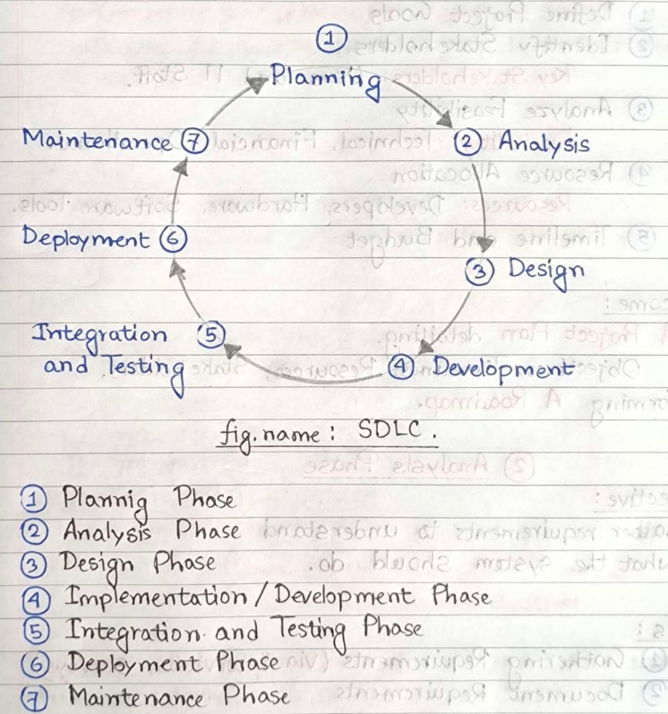
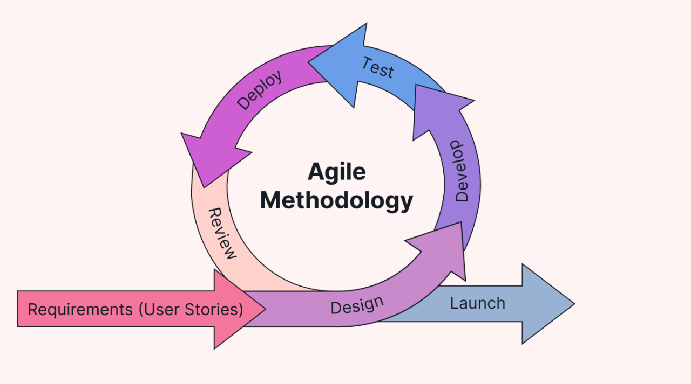
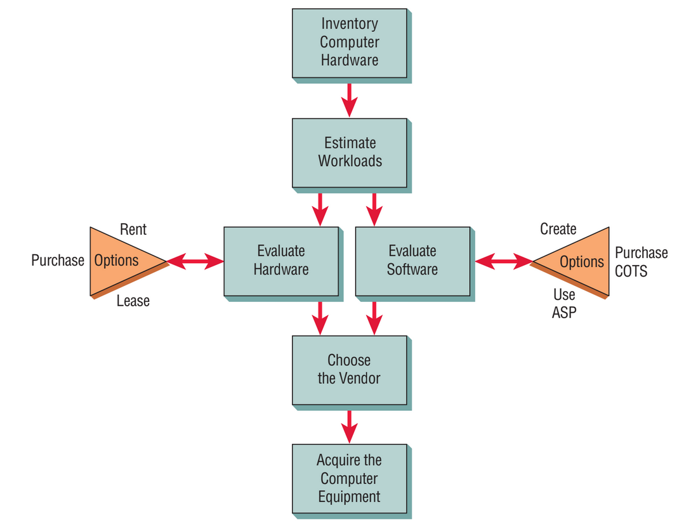
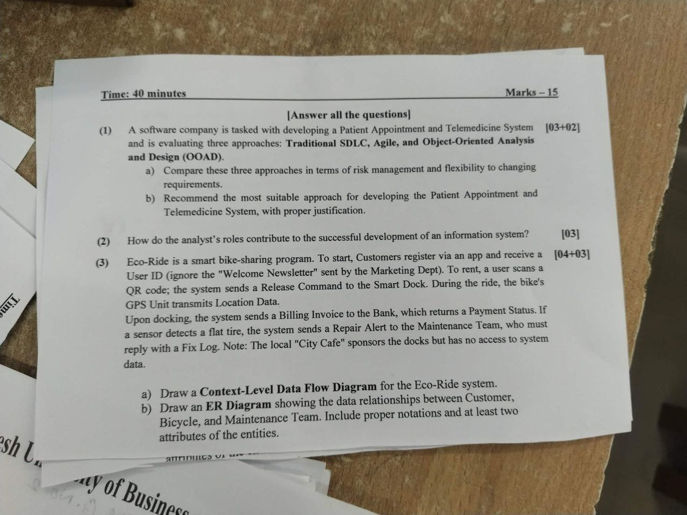
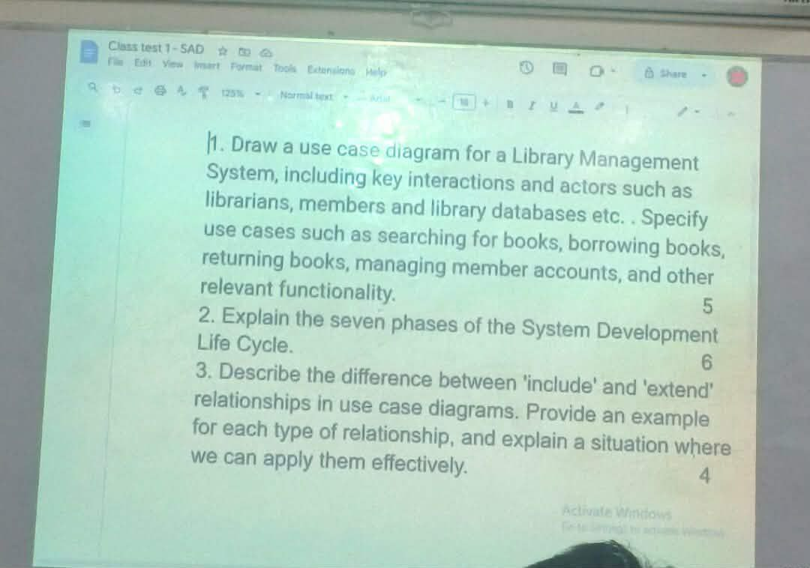
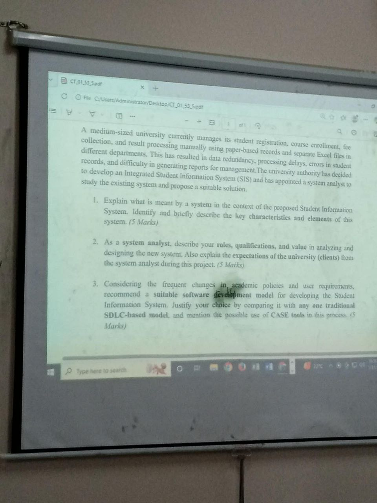
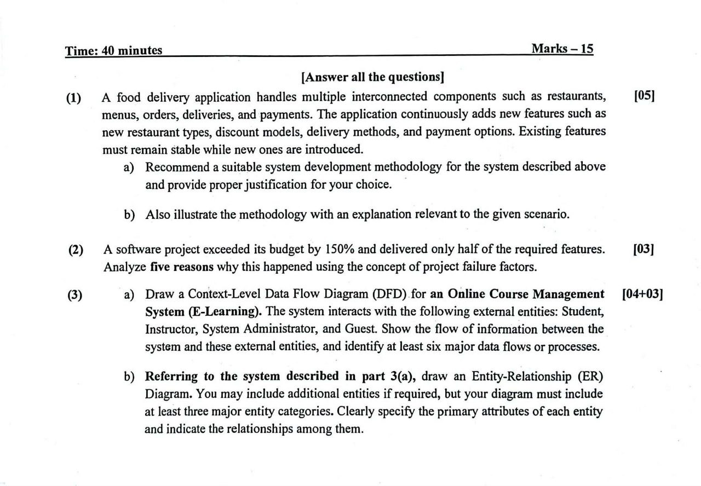
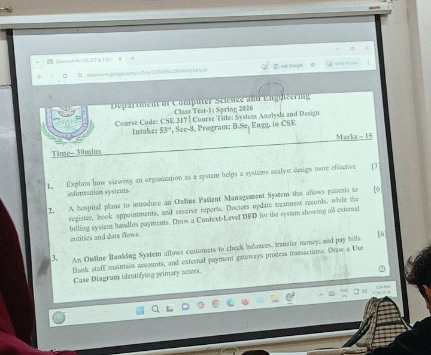

## Mid Term Examination

### Topic List

1. [**Definitions**](#definitions)
    - Information, Data, System, Information System
    - System Analysis, System Analyst
    - Design Methodology
    - SDLC, Agile, OOSAD
    - CASE Tools
    - Sprint
    - SCRUM
    - DFD, ER Diagram, Use Case Model
    - Project, Project Scheduling
    - PERT Diagram
    - Earliest Start (ES), Earliest Finish (EF)
    - Latest Start (LS), Latest Finish (LF)
    - Total (Project) Completion Time
    - Slack Time
    - Critical Path
    - Problem Statement
    - Rent & Lease

2. [**Theoretical Questions**](#theoretical-questions)
    - **Chapter I**
        1. [Roles of a System Analyst](#11-roles-of-a-system-analyst)
        2. [Qualities of a System Analyst](#12-qualities-of-a-system-analyst)
        3. [Characteristics of SLDC, SDLC Figure](#13-software-development-life-cycle-sdlc)
        4. [Agile Development](#14-agile-methodology)
        5. [Principles](#15a-principles-of-agile) & [Core Practices of Agile](#15b-core-practices-of-agile)
        6. [Five Stages of Agile Development](#15e-five-stages-of-agile-development)
        7. [OOSAD](#17a-oosad-methodology), [Usage of OOSAD](#17b-usage-of-oosad)
        8. [SDLC vs Agile vs OOSAD](#18-difference-between-sdlc-agile-and-oosad)
        9. [SDLC, Agile or OOSAD - When to use each?](#19a-when-to-use-sldc)
        10. [Types of CASE Tools](#110-types-of-case-tools)

    - **Chapter II**
        1. [Forces that shape an Organization](#21-forces-that-shape-an-organization)
        2. [ER Diagram: Entity and Relationship Types](#22-entity-and-relationship-types)
        3. [Components of Use Case Model](#23-components-of-use-case-model)
        4. [Types of Behavioral Relationships](#24-types-of-behavioral-relationships)
        5. [Why do we need a Use Case Model?](#25-why-do-we-need-a-use-case-model)
        6. [Use Case Scenario](#26a-use-case-scenario)

    - **Chapter III**
        1. Gantt Chart
        2. [PERT Diagram](#32-pert-diagram)
        3. [What are some reasons to initiate a new project?](#33-what-are-some-reasons-to-initiate-a-new-project)
        4. [How to identify if we need to initiate a new project?](#34-how-to-identify-if-we-need-to-initiate-a-new-project)
        5. [Feasibility Analysis: Assessment & Output](#35-feasibility-analysis)
        6. [Types of Feasibility Analysis](#36-types-of-feasibility-analysis)
        7. [Why is Feasibility Analysis needed?](#37-why-is-feasibility-analysis-needed)
        8. [Ascertaining Hardware and Software Needs: Chart](#38-ascertaining-hardware-and-software-needs)
        9. [When to buy, rent, or lease?](#39-when-to-buy-rent-or-lease)

3. **Scenario-based Questions**
    - Gantt Chart, PERT Diagram
    - Context Level DFD
    - ER Diagram
    - Use Case Model **(5 Marks Confirmed)**
    - Choose appropriate Design Methodology and justify your answer

### CT Questions

- [**Section 1**](#section-1)
- [**Section 3**](#section-3)
- [**Section 5**](#section-5)
- [**Section 7**](#section-7)
- [**Section 8**](#section-8)

---

### Full Forms

| Abbreviation      | Phrase                                     |
| ----------------- | ------------------------------------------ |
| SDLC              | Software Development Life Cycle            |
| OOSAD             | Object-Oriented System Analysis and Design |
| UML               | Unified Modeling Language                  |
| CASE              | Computer-Aided Software Engineering        |
| DFD               | Data Flow Diagram                          |
| ER&nbsp;Diagram   | Entity-Relationship Diagram                |
| PERT&nbsp;Diagram | Program Evaluation and Review Technique    |
| SRS               | Software Requirement Specification         |
| RoI               | Return on Investment                       |
| ASP               | Application Service Provider               |
| CTOS              | -                                          |

---

### Definitions

- <ins><strong>Information:</strong></ins> Raw data that has been processed, organized, and given context, making it meaningful for tasks like decision-making or communication. **Information essentially turns facts into understanding.**

- <ins><strong>Data:</strong></ins> Raw, unorganized facts, figures, symbols, or images (_e.g.:_ a series of digital pixels)

- <ins><strong>System:</strong></ins> **A group of interrelated components** that **functions together to achieve a goal**.

- <ins><strong>Information System:</strong></ins> An arrangement of **people, data, processes,** and **information technology** that interact to **collect, process, store,** and **provide** as output the information needed to support an organization.

- <ins><strong>System Analysis:</strong></ins> The collection of **notations, methodologies,** and **tools** to analyze a problem situation so that we can deliver a system that meets user requirements.

- <ins><strong>System Analyst:</strong></ins> A person who uses analysis and design techniques to solve business problems using information technology.

- <ins><strong>Design Methodology:</strong></ins> A structural framework, process or set of principles guiding designers from problem identification to solution.
    - <ins><strong>SDLC:</strong></ins> A cost-effective and time-efficient process that development teams use to design and build high-quality software.

    - <ins><strong>Agile:</strong></ins> An iterative, team-based approach to software development that focuses on delivering software faster, enhancing flexibility, and improving collaboration.

    - <ins><strong>OOSAD:</strong></ins> A structural methodology that models systems as interacting, real-world objects.

- <ins><strong>CASE Tools:</strong></ins> Software application programs that automate SDLC activities to improve software development productivity, quality, and speed.

- <ins><strong>Sprint:</strong></ins> Short, time-boxed, and repeatable development cycles, used to break large projects into manageable, actionable chunks.

- <ins><strong>SCRUM:</strong></ins> A management framework that teams use to self-organize tasks and work towards a specific goal.

- <ins><strong>DFD:</strong></ins> A graphical tool that maps flow of information for any process or system.

- <ins><strong>ER Diagram:</strong></ins> A high-level conceptual data model that visually represents the structure of a database system.

- <ins><strong>Use Case Model:</strong></ins> A visualization of a system that shows what users can do within a system.

- <ins><strong>Project:</strong></ins> A collection of organized tasks that can be performed either in sequential or in parallel manner to achieve a specific goal.

- <ins><strong>Project Scheduling:</strong></ins> The process of organizing and mapping out the sequences of tasks, timelines, and resources necessary to complete a project efficiently.

- <ins><strong>PERT Diagram:</strong></ins> A project management tool used to map out, schedule, and coordinate tasks within a project by visualizing task dependencies and timelines.

- <ins><strong>Slack Time (or float):</strong></ins> The amount of time a task can be delayed without affecting the project's overall deadline or subsequent tasks.

- <ins><strong>Critical Path:</strong></ins> The longest sequence of dependent tasks that must be completed on time for a project to finish by its deadline.

- <ins><strong>Problem Statement:</strong></ins> A concise, data-driven description of an issue, gap, or pain point that a project aims to resolve.

- <ins><strong>Rent and Lease:</strong></ins> Renting is short-term (weeks to months), allowing for quick moves. Leasing is a long-term, fixed-period contract, often 12 months or longer.

---

### Theoretical Questions

#### 1.1. Roles of a System Analyst

A system analyst must be experienced in working with computers and be able to work with people of all descriptions.

A System Analyst has three primary roles -

1. **Consultant** (The Problem Solver)
    - Analyzes existing systems

    - Gathers requirements

    - Proposes solutions

2. **Agent of Change** (The Facilitator)
    - <ins><strong>Bridges gaps:</strong></ins> Acts as a connection between business departments (_who need solutions_) and technical teams (_who build solutions_)

    - <ins><strong>Manages implementation:</strong></ins> Oversees the development and deployment of new systems, ensuring they meet specifications and integrate smoothly.

    - <ins><strong>Trains users:</strong></ins> Develops training programs and documentation to help employees adapt to new software and processes.

3. **Supporting Expert** (The Technical Guide)
    - <ins><strong>Designs systems:</strong></ins> Creates functional specifications, system architecture, and design documents for developers.

    - Tests and monitors systems

    - Stays up-to-date

---

#### 1.2. Qualities of a System Analyst

A great system analyst combines strong analytical and problem-solving skills with excellent communication, business acumen and technical knowledge to bridge the gap between IT and business needs.

Key qualities include -

1. Problem-solving
2. Communication
3. Strong personal and professional ethics
4. Self discipline and self-motivation

- <ins><strong>Problem Solving</strong></ins>

    Views the analysis of problems as a challenge and enjoys devising workable solutions.

- <ins><strong>Communication</strong></ins>
    1. Capable of relating meaningfully to other people over extended periods of time.

    2. Has enough computer experience to program and to understand the capabilities of computers.

    3. Obtain information requirements from users.

    4. Communicate what is needed to programmers.

- <ins><strong>Personal and Professional Ethics</strong></ins>

    Involves prioritizing public welfare, honesty, integrity, unbiased judgement and competence. It focuses on protecting user safety and data privacy while delivering qualityful and reliable systems. It ensures transparency, avoiding conflicts of interest and respecting colleagues and clients.

---

#### 1.3. Software Development Life Cycle (SDLC)

SDLC is a cost-effective and time-efficient process that development teams use to design and build high-quality software.

SDLC follows a systematic and oderly approach

- There is only way forward
- There is no undo button

<p align="center"><br><i>figure 1.3: Software Development Life Cycle (SDLC) and its phases.</i></p>

<ins><strong>SDLC Characteristics:</strong></ins>

1. Developed through the use of specific cycles of activities by analyst and user.

2. Each phase has unique user activities and certain deliverable.

<ins><strong>SDLC Prerequisites:</strong></ins>

1. Users should know what they need. (**clear SRS**)

2. No repeated changes.

<ins><strong>When to use SDLC?</strong></ins>

1. When the requirements are clear and detailed.

2. When project scope, goals, budget and resources are defined.

<ins><strong>Where to use SDLC?</strong></ins>

1. Developing healthcare and Govt. systems.

2. Developing banking systems. (like ATM)

---

#### 1.4. Agile Methodology

Agile is an iterativem team-based approach to software development and project management that focuses on delivering value faster, enhancing flexibility, and improving collaboration.

Agile is a way to manage projects by breaking them into smaller parts. It focuses on working together and making constant improvements.

Most industry level software projects follow the **Agile Methodology**.

<p align="center"><br><i>figure 1.4: Agile methodology.</i></p>

Agile offers -

1. Incremental delivery (called **Sprint**s)
2. Collaboration and Flexibility
3. Continual learning

- <ins><strong>Collaboration:</strong></ins>
    1. Flexible application and fast delivery.

    2. Proper transparent communication.

    3. No unneccessary documents.

    4. User-centric feedback in every phase of development.

- <ins><strong>Flexibility:</strong></ins>
    1. Low budget,

    2. Flexible timing,

    3. Always delivers the best quality.

- <ins><strong>Continual Learning:</strong></ins>
    1. Learning the users need as the project progresses.

    2. Implement new technologies on the fly.

**Agile is easy to understand but hard to master.**

Agile is based on -

- Values (Beliefs)
- Principles (How engineers act and think)
- Core Practices (What engineers do daily)

<ins><strong>Values of Agile:</strong></ins>

1. Communication,
2. Simplicity,
3. Riskier features are implemented later,
4. User feedback.

<ins><strong>Sprint Duration:</strong></ins> 1/2 week (max 4 weeks)

---

#### 1.5A. Principles of Agile

1. Deliver software frequently
2. Embrace change
3. Work with customers regularly
4. Keep a sustainable pace
5. Improve continously

#### 1.5B. Core Practices of Agile

1. Work in short cycles
2. Daily meetings
3. Tests frequently
4. Collaborate as a team

#### 1.5C. The Agile Team

1. **"The show must go on"**
2. Every developer can do multiple functions
3. Transparent and Collaborative

#### 1.5D. Adjustable Resources of Agile Development

1. Time
2. Cost
3. Quality (ensuring best quality)
4. Scope

---

#### 1.6A. Five Stages of Agile Development

1. Exploration

2. **Planning:** Customer decides what the development should tackle first.

3. **Iterations of First Release:** This is a continuous process. Here customer feedback is considered and daily meetings are hold.

4. **Productionizing:** A working software with initial features is being produced here.

5. **Maintenance:** Here riskier customer suggestions are considered. Team members may be rotated on or off the team.

#### 1.6B. Agile Characteristics

- Agile development demans skillful developers.

- Agile development is user-centric.

#### 1.6C. Where to use Agile?

1. In user-centric development projects, (e-commerce)

2. Where time and budget is flexible,

3. Where fast software delivery is expected.

---

#### 1.7A. OOSAD Methodology

OOSAD is a structural methodology that models systems as interacting, real-world objects.

- Uses object-oriented fundamentals.
- Maximum time is spent on design.

<ins><strong>OOSAD Phases:</strong></ins>

1. Analysis
2. Design
3. Implementation
4. Maintenance

<ins><strong>OOSAD Characteristics:</strong></ins>

1. Uses the four principles of **OOP** (**Inheritance, Polymorphism, Encapsulation, Abstraction**)
2. Focuses on real-world objects.
3. More importance on modeling the software.
4. Riskier features are usually implemented first.

<ins><strong>Benefits of OOP:</strong></ins>

1. Re-useability
2. Modularity

#### 1.7B. Usage of OOSAD

- Rapidly changing features and updates.
- When the system is very complex.

---

#### 1.8. Difference between SDLC, Agile, and OOSAD

| Aspect              | SDLC                                        | Agile                               | OOSAD                                             |
| :------------------ | :------------------------------------------ | :---------------------------------- | :------------------------------------------------ |
| Approach            | **Linear**, Sequential                      | Iterative, **Incremental**          | Interative, **Object-Oriented**                   |
| Flexibility         | **Low** adaptibility to change              | **High** adaptibility to change     | **Moderate** flexibility, but more upfront design |
| Documentation       | **Extensive** documentation for each phase  | **Minimal**                         | **Detailed modeling** using UML                   |
| Team Involvement    | Silos between phases (analysts, developers) | Collaborative, cross-functional     | Collaborative, but more focused on modeling       |
| Development Process | Clear, structured phases                    | Short sprints with regular feedback | Focus on designing objects and their behaviors    |
| Best for            | **Well-defined**, stable projects           | **Rapidly changing** requirements   | Complex, **long-term scalable** systems           |

---

#### 1.9A. When to use SLDC?

- When the project goals and requirements are well-defined.
- When the project has a clear SRS document.
- When there needs to be a fully featured project ready to be launched.
- When there are adequate resources and time to complete the full SDLC.

#### 1.9B. When to use Agile?

- When applications need to be developed quickly in response to a dynamic environment.
- When developing a fail-safe or backup system.
- When the customer is satisfied with incremental improvements.
- Where executives and analysts agree with the principles of Agile methodology.

#### 1.9C. When to use OOSAD?

- When systems can be added gradually, one subsystem at a time.
- When reuse of previously written software is possible. When the systems are modular.
- When it is acceptable to tackle the difficult problems first.

---

#### 1.10. Types of CASE Tools

1. **Upper CASE:** Follows first 3 steps of SDLC.

2. **Lower CASE:** Follows last 4 steps of SDLC.

3. **Integrated CASE:** Hybrid of upper case and lower case.

---

#### 2.1. Forces that shape an Organization

Three main forces interact to shape an organization:

1. Levels of Management
    1. **Strategic Management:** Focuses on short-term goals, (weekly/monthly), Defines the organization as a whole.
    2. **Middle Management:** Intercommunicates between strategic and operational managements,
    3. **Operational managements:** Employees who perform regular activities.

2. Organizational Environments
    1. Community (Has a physical location)
    2. Economic (Market factors)
    3. Political (State and local government)
    4. Legal (Federal, State, Regional)

3. Organizational Culture
    1. **Open System:** Free flow of information. Output from one system becomes input to another.
    2. **Closed System:** Restricted access to information.

---

#### 2.2. Entity and Relationship Types

Focus on entities and how they are connected with each-other.

<ins><strong>Relationship Types:</strong></ins>

1. One to One
2. One to Many
3. Many to Many

<ins><strong>Types of Entities:</strong></ins>

1. Fundamental (**Strong**) Entity
    - A real life object that can exist **independently**.
    - Can have one or more attributes.
    - **Example:** Student, Course, Employee.

2. Associative Entity
    - Created to resolve a **Many to Many** relationship between fundamental entities.

3. Attributive (**Weak**) Entity
    - Less likely used.
    - Used to store multi-valued attributes of fundamental entities.
    - Depends on fundamental entities.
    - **Example:** Phone Number.

---

#### 2.3. Components of Use Case Model

Use Case Model reveals what users can do within a system. It consists of three components:

1. **Actor**
    - **Primary Actor:** Gets benefit from the system.
    - **Supporting Actor:** Helps to keep the system running.

2. **Use Case**
    - Shows the requirements of the system.
    - Shows the tasks/functions an actor can perform using the system.

3. **Behavioral Relationships**

    Shows the interactions between,
    - **Actor** ~ **Use Case**
    - **Use Case** ~ **Use Case**
    - **Actor** ~ **Actor**

---

#### 2.4. Types of Behavioral Relationships

1. <ins><strong>Communicates</strong></ins>
    - Relationship between Actor ~ Use Case.
    - Represented with a solid line.
    - **Symbol:** ———
    - **Representation:**
        ```
        Actor ——— (Use Case)
        ```

2. <ins><strong>Includes</strong></ins>
    - **Mandatory**
    - Relationship between Use Case ~ Use Case.
    - One use case always includes another use case as part of its behavior.
    - One is **Base Use Case** and the other is **Included Use Case**.
    - The included use case must happen every time the base use case happens.
    - **Symbol:** ----&lt;&lt;includes&gt;&gt;----&gt;
    - **Representation:**
        ```
        (Base Use Case) ---<<includes>>---> (Included Use Case)
        ```

3. <ins><strong>Excludes</strong></ins>
    - **Optional**
    - One use case optionally extends another use case under certain conditions.
    - Happens only sometimes.
    - Adds extra behavior to the **Base Use Case**.
    - **Symbol:** ----&lt;&lt;extends&gt;&gt;----&gt;
    - **Representation:**
        ```
        (Base Use Case) <---<<extends>>--- (Extended Use Case)
        ```

4. <ins><strong>Generalizes</strong></ins>
    - Shows that a specialized thing inherits behavior from a general thing.
    - The relationship can be between,
        - **Use Case** ~ **Use Case**
        - **Actor** ~ **Actor**
    - **Symbol:** ———▷
    - **Representation:**
        ```
        Specialized ———▷ General
        ```

**Note:** Actors are external entity. So, the use case must be within a system boundary (rectangle) and the actors must be placed outside of it.

---

#### 2.5. Why do we need a Use Case Model?

- Use cases effectively communicate system requirements because the diagrams are kept simple.

- Use cases allow people to tell stories.

- Use case stories make sense to non-technical people.

- Use cases don't depend on a special language.

- Use cases can describe most functional requirements (such as **interaction between actors and applications**)

- Use cases can describe non-functional requirements (such as **performance and maintainability**) through the use of stereotypes.

- Use cases help analysts define boundaries.

- Use cases can be traceable, allowing analysts to identify links between use cases and other design and documentation tools.

---

#### 2.6A. Use Case Scenario

Use Case Scenario is a specific, step-by-step description of how an actor interacts with a system to acheive a goal, detailing a signle path through a use case.

Parts of a Use Case Scenario:

1. <ins><strong>Area Header:</strong></ins> Includes initiators and identifiers.
    - Name and Unique ID
    - Application Area
    - Actors and Stakeholders
    - Use Case Level
    - Use Case Description

2. <ins><strong>Steps Performed:</strong></ins> Steps required to suceessfully execute the use case.

3. <ins><strong>Footer:</strong></ins>
    - Preconditions
    - Assumptions
    - Questions
    - Other information

#### 2.6B. Use Case Level

- <ins><strong>White (Clouds):</strong></ins> Enterprise level
- <ins><strong>Kite:</strong></ins> Business/Department level (HR)
- <ins><strong>Blue (Sea):</strong></ins> User level
- <ins><strong>Indigo (Fish):</strong></ins> Functional or subfunctional level (OTP generation)
- <ins><strong>Black (Calm):</strong></ins> Technical level (Most detailed)

---

#### 3.2. PERT Diagram

**Node**

| **A** |  ES |  EF |
| :---- | --: | --: |
| **t** |  LS |  LF |

1. Activities with no predecessors can be started in parallel.
2. Activities that are **NOT** predecessors of any other activity will be connection to the **FINISH** node.
3. Forward Pass ——▷ **Maximum** of successor nodes
4. Backward Pass ——▷ **Minimum** of successor nodes
5. **FINISH** node(s) denote the Total Project Completion Time.
6. Slack Time = _LF - EF_ or _LS - ES_
7. Critical Activities = Nodes of which the slack time are **zero**.
8. Critical Path = Consists of Critical Activities, connected with a line/dash.
9. "Show PERT Chart only" = "Show Forward Pass only"

---

#### 3.3. What are some reasons to initiate a new project?

A collection of organized tasks that can be performed either in sequential or in parallel manner to achieve a specific goal.

There are mainly two reasons that might require to initiate a new project -

1. Facing problems in the current infrastructure.
2. Opportunities to improve, installing new systems.

---

#### 3.4. How to identify if we need to initiate a new project?

1. Asking for user feedback,
2. Check performance benchmarks: Current vs New solution,
3. Frequent job turnovers and dissatisfaction.

---

#### 3.5. Feasibility Analysis

Feasibility Analysis is a type of study that determines whether a system can be practically and successfully developed using the available resources.

Feasibility is assessed in **three ways**:

- Operationally
- Technically
- Economically

Possible feasibility outputs:

- Accepted
- Rejected
- Accepted with modifications

---

#### 3.6. Types of Feasibility Analysis

Feasibility Analysis is done using the **TELOS** criteria.

- <ins><strong>Techincal Feasibility</strong></ins>
    1. Tools and hardware required to build the project.
    2. Technical expertise that the development team is expected to have to build the project.

- <ins><strong>Economical Feasibility</strong></ins>
    1. Development costs (Startup costs) and Operating costs are within the budget.
    2. RoI analysis to determine whether the project would generate any revenue.

- <ins><strong>Legal Feasibility</strong></ins> (NOT Needed)
    1. Ensure no major legal barriers are hindering the development of the project.

- <ins><strong>Operational Feasibility</strong></ins>
    1. Ensure enough human resources are present to operate and maintain the project.
    2. Ensure the human resources are skillful. If they are not - consult training programs for them.

- <ins><strong>Schedule Feasibility</strong></ins> (NOT Needed)
    1. Ensure the project completes within the expected time frame.

---

#### 3.7. Why is Feasibility Analysis needed?

A feasibility study is important because it is based on a organizational desire to get things right before committing resources, time or budget. A feasibility study might uncover new ideas that could completely change a project's scope. There a some key benefits of conducting a feasibility study:

1. Improves project teams' focus
2. Identifies new opportunities and problems with the current design decisions.
3. Narrows the business alternatives.
4. Identifies valid reasons to undertake or reject the project.
5. Enhances the success rate by evaluating multiple parameters.
6. Gives stakeholders a clear picture of the proposed project.

---

#### 3.8. Ascertaining Hardware and Software Needs

<p align="center"><br><i>figure 3.8: Steps in aquiring computer hardware and software.</i></p>

---

#### 3.9. When to buy, rent, or lease?

|         | Advantages                                                                                  | Disadvantages                                                                                                                          |
| :------ | :------------------------------------------------------------------------------------------ | :------------------------------------------------------------------------------------------------------------------------------------- |
| Buying  | • Cheaper than leasing or renting over the long run<br>• Full control                       | • Initial cost is high<br>• Risk of obsolescence<br>• Risk of being stuck if choice was wrong<br>• Full responsibility                 |
| Leasing | • No captial is tied up<br>• Cheaper than renting                                           | • Company doesn't own the system when expired.<br>• Usually a heavy penanlty for terminating the lease<br>• More expensive than buying |
| Renting | • No captial is tied up<br>• Easy to change systems<br>• Maintenance and insurance included | • Company doesn't own the computer<br>• Cost is very high as vendor assumes the risk<br>• The most expensive option in the long run    |

---

#### CT Questions

These were collected by **Kazi Zakaria**.

##### Section 1

<p align="center"></p>

##### Section 3

<p align="center"></p>

##### Section 5

<p align="center"></p>

##### Section 7

<p align="center"></p>

##### Section 8

<p align="center"></p>

## Final Term Examination

### Topic List

### CT Questions

### Full Forms

### Definitions

### Theoretical Questions

#### CT Questions
