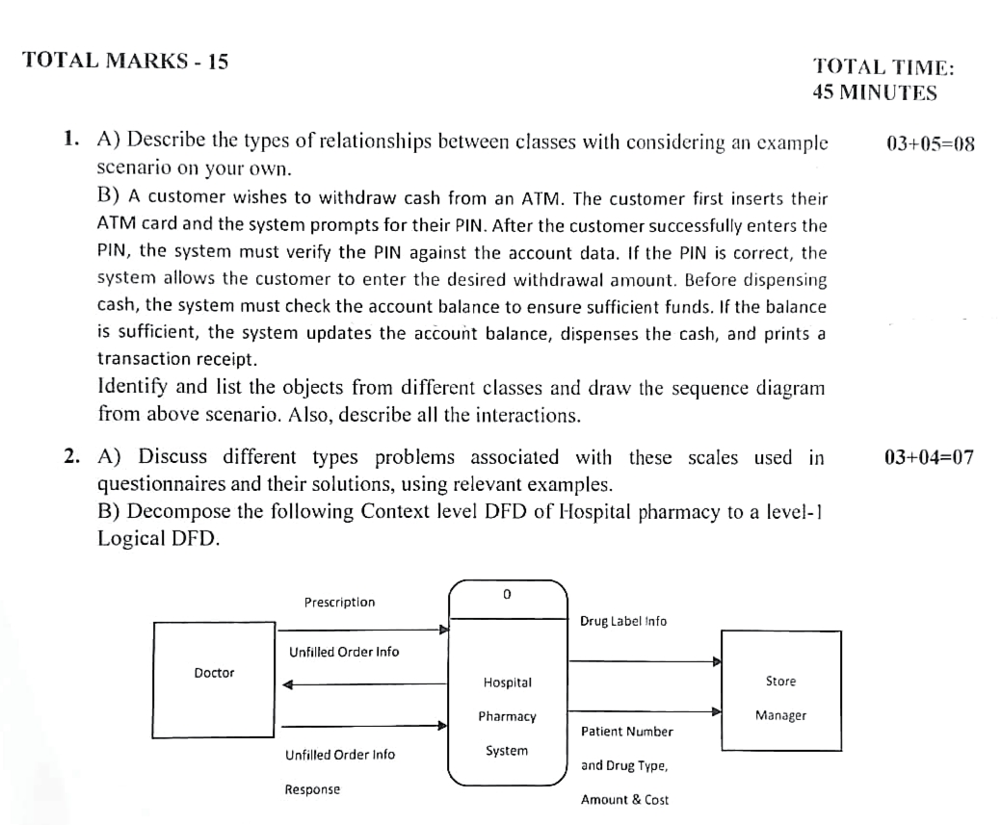
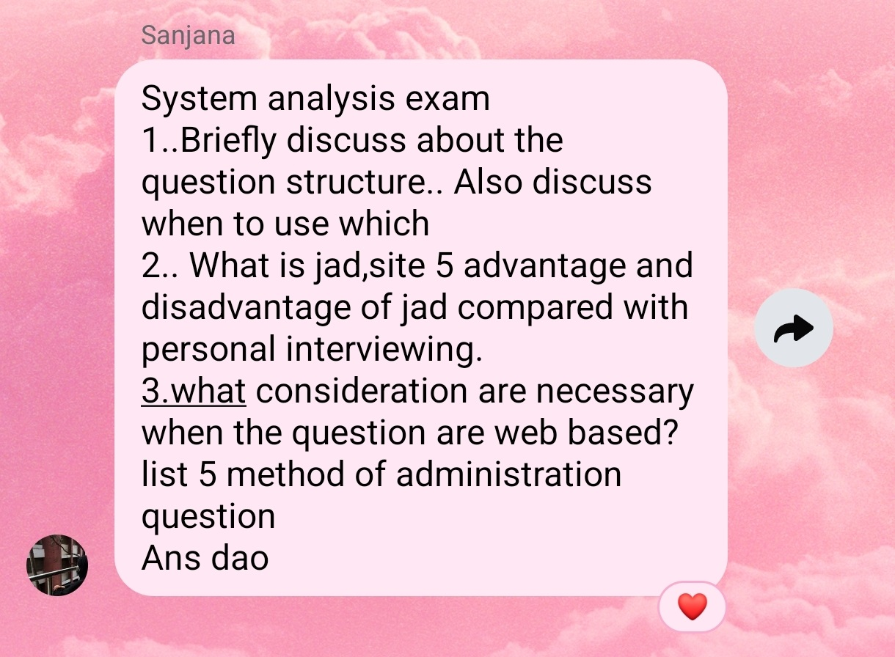

## Final Term Examination

### Topic List

1. **Chapters and Selected Topics**
    - [**Chapter 4**](#chapter-4-1) (_1 set question_)
        - Information Gathering Methods
        - Interview Preparation
        - Questionnaire and its types
        - Probing Question
        - Questionnaire Structure (Pyramid, Funnel, Diamond)
        - Questionnaire Language
        - Joint Application Development **(JAD)**, its conditions, advantages and disadvantages
        - Measurement Scales and their problems

    - [**Chapter 7**](#chapter-7-1) (_1 set question_)
        - Context Level DFD (from _Mid_)
        - Level 1, Level 2 DFD
        - DFD Construction Rules
        - Logical DFD vs Physical DFD

    - [**Chapter 10**](#chapter-10-1) (_1 set question_)
        - Benefits of UML
        - Class Responsibilities Collaborators **(CRC)**
        - UML Relationships
        - UML Diagrams
        - ECB Sequence Diagram

    - [**Chapter 11**](#chapter-11) (_half set question_)
        - Categories of Information
        - Purpose of Business Reports
        - Objectives of Output Designs
        - Advantages and Disadvantages of Output Designing
        - Factors for choosing output technologies and methods
        - Output bias and mitigation
        - Website Designing

    - [**Chapter 12**](#chapter-12) (_half set question_)
        - Input Design Objectives
        - Seven Sections of a Form
        - Captions in a Form

2. [**Definitions**](#definitions)
    - System Requirements
    - System Information
    - Interview
    - Interviewer & Interviewee
    - Joint Application Development **(JAD)**
    - Questionnaire
    - Open-Ended Question
    - Bi-polar/Close-Ended Question
    - Probing Question
    - Scribe
    - Measurement Scales
    - Nominal Scale and Interval Scale
    - Leniency Bias
    - Central Tendency
    - Halo Effect
    - Easy Raters
    - Context Level DFD
    - Level 1 DFD **(Diagram 0)**
    - Primitive Process
    - CRUD Matrix
    - Object Oriented Programming **(OOP)**
    - Unified Modeling Language **(UML)**
    - Class Responsibilities Collaborators **(CRC)**
    - Object Oriented System Analysis and Design **(OOSAD)**
    - UML Diagram
    - Acitivity Diagram
    - Class Diagram
    - Sequence Diagram
    - ECB Sequence Diagram
    - State Chart

3. [**Theoretical Questions**](#theoretical-questions)
    - **Chapter 4**
        1. [Explain information gathering methods.](#41-explain-information-gathering-methods)
        2. [Explain the steps of preparing for an interview in the context of information gathering.](#42-explain-the-steps-of-preparing-for-an-interview-in-the-context-of-information-gathering)
        3. [What is a Questionnaire? Explain its types with suitable examples.](#43-what-is-a-questionnaire-explain-its-types-with-suitable-examples)
        4. [Discuss the pros and cons of open-ended questions and close-ended questions.](#44-discuss-the-pros-and-cons-of-open-ended-questions-and-close-ended-questions)
        5. [Show the key differences between open-ended and close-eneded questions.](#45-show-the-key-differences-between-open-ended-and-close-eneded-questions)
        6. [What is a Probing Question?](#46-what-is-a-probing-question)
        7. [Discuss question structures in a questionnaire.](#47-discuss-question-structures-in-a-questionnaire)
        8. [How the questionnaire language should sound like?](#48-how-the-questionnaire-language-should-sound-like)
        9. [What is JAD? Which conditions support the use of JAD?](#49a-what-is-jad-which-conditions-support-the-use-of-jad)
        10. [When to avoid using JAD?](#49b-when-to-avoid-using-jad)
        11. [What are the benefits of using JAD?](#49c-what-are-the-benefits-of-using-jad)
        12. [What are the drawbacks of JAD?](#49d-what-are-the-drawbacks-of-jad)

    - **Chapter 7**
        1. TODO

    - **Chapter 10**
        1. TODO

    - **Chapter 11**
        1. TODO

    - **Chapter 12**
        1. TODO

### CT Questions

- [**Section 1**](#section-1)
- [**Section 3**](#section-3)

---

### Full Forms

| Abbreviation | Full Form                                  |
| :----------- | :----------------------------------------- |
| IS           | Information Systems                        |
| JAD          | Joint Application Development              |
| DFD          | Dataflow Diagram                           |
| CRUD         | Create/Read/Update/Delete                  |
| OOP          | Object Oriented Programming                |
| UML          | Unified Modeling Language                  |
| CRC          | Class Responsibilities Collaborators       |
| OOSAD        | Object-Oriented System Analysis and Design |
| ECB          | Entity-Control-Boundary                    |

### Definitions

#### Chapter 4

- <ins><strong>System Requirements:</strong></ins> System requirements are detailed, actionable statements defining what a system must do (functions) and how it must perform (qualities) to meet stakeholder needs, acting as a blueprint for developers.

- <ins><strong>Information System (IS):</strong></ins> An information system (**IS**) is a set of interrelated components: people, data, processes, and technology; that collect, process, store, and distribute information to support decision-making, coordination, and control in an organization.

- <ins><strong>Interview:</strong></ins> An interview is a structured, purposeful conversation where one participant (**the interviewer**) asks questions, and the other (**the interviewee**) provides answers to exchange information.

- <ins><strong>Interviewer & Interviewee:</strong></ins> An interviewer is a person who conducts an interview by asking questions to another person, known as the interviewee.

- <ins><strong>JAD (Joint Application Development):</strong></ins> Joint Application Development (**JAD**) is a collaborative methodology that brings together key users, managers, and analysts in structured, facilitated workshops to define, design, and develop software requirements.

- <ins><strong>Questionnaire:</strong></ins> A questionnaire is a research tool consisting of a structured series of written questions designed to gather quantitative or qualitative information from respondents.

- <ins><strong>Open-Ended Question:</strong></ins> Open-ended questions are inquiries that require more than a "yes" or "no" answer, encouraging detailed, qualitative responses in the respondent's own words.

    They typically begin with "how," "what," "why," or phrases like "tell me about," aiming to foster dialogue, elicit deeper thoughts, and uncover motivations.

- <ins><strong>Bi-polar/Close-Ended Question:</strong></ins> Bipolar (or **two-point**) and close-ended questions are restrictive, structured queries designed to get specific, quantifiable answers.

    Close-ended questions are structured queries designed to elicit specific, limited responses: typically "yes/no," true/false, or multiple-choice options, rather than detailed narratives.

    Bipolar questions often feature two opposite extremes (e.g., "Very Good" to "Very Bad"). They are commonly used in diagnostics, surveys, and assessments to measure specific attitudes, behaviors, or symptoms.

- <ins><strong>Probing Question:</strong></ins> Probing questions are open-ended, follow-up inquiries designed to elicit deeper thought, uncover details, and explore underlying assumptions, moving beyond basic information.

- <ins><strong>Scribe:</strong></ins> A scribe in **Joint Application Development (JAD)** is a dedicated role responsible for documenting the entire JAD process, capturing key decisions, action items, and requirements during sessions.

- <ins><strong>Measurement Scales:</strong></ins> Measurement scales are essential frameworks in information gathering and research used to define, categorize, and quantify variables.

- <ins><strong>Nominal Scale and Interval Scale:</strong></ins> **Nominal scales** are used for naming, labeling, or classifying variables into distinct groups, with no quantitative value or inherent order.

    **Interval scales** are quantitative scales featuring order, meaningful/equal distances (intervals) between values, but **no true zero point.**

- <ins><strong>Leniency Bias:</strong></ins> The Leniency Effect (or Leniency Bias) in information gathering refers to the systematic tendency for evaluators to provide ratings that are consistently higher-more positive or generous-than the actual performance or objective data justifies.

    This bias often results from a desire to avoid conflict, a wish to be seen as supportive, or an attempt to protect subordinates.

- <ins><strong>Central Tendency:</strong></ins> Central tendency bias occurs when survey respondents avoid extreme scale options (e.g., "Very Satisfied" or "Extremely Unlikely") and cluster their answers around the middle, leading to compressed data and muted, inaccurate results.

- <ins><strong>Halo Effect:</strong></ins> The halo effect in surveys is a cognitive bias where a respondent’s overall positive or negative impression of a brand, person, or product influences their ratings of specific, individual attributes.

    This causes skewed data, as a general feeling overshadows objective evaluation.

- <ins><strong>Easy Raters:</strong></ins> Easy raters are respondents who exhibit a **leniency bias**, consistently providing overly positive or high ratings regardless of the actual quality or performance being evaluated.

#### Chapter 7

- <ins><strong>Context Level DFD:</strong></ins> A Context Level Data Flow Diagram (DFD), also known as a Level 0 DFD, is a high-level, top-down visual overview of a system.

    It represents the entire system as a single process, highlighting its boundaries, external entities (users/systems), and data flows.

    It defines the system's scope without technical detail.

- <ins><strong>Level 1 DFD (Diagram 0):</strong></ins> A Level 1 Data Flow Diagram (DFD), often called **"Diagram 0"** is a detailed, exploded view of a Context Diagram (Level 0) that breaks down a single main system process into several high-level sub-processes.

- <ins><strong>Primitive Process:</strong></ins> A Primitive Process in a Level 1 Data Flow Diagram (DFD) is the lowest level of functional decomposition, representing an atomic, specific task that cannot be broken down further.

    It acts as a foundational building block, often described as a functional primitive or atomic function.

- <ins><strong>CRUD Matrix:</strong></ins> A CRUD matrix is a table that maps system processes or user roles to specific data entities, defining who can Create, Read, Update, or Delete data.

    It acts as a project management and system design tool to define permissions.

#### Chapter 10

- <ins><strong>Object Oriented Programming (OOP):</strong></ins> Object-oriented programming (**OOP**) is a programming paradigm based on organizing software design around data, or "objects" rather than functions and logic.

- <ins><strong>Unified Modeling Language (UML):</strong></ins> Unified Modeling Language (**UML**) is a standardized, general-purpose graphical modeling language used to visualize, specify, construct, and document software-intensive systems and business processes.

- <ins><strong>Class Responsibilities Collaborators (CRC):</strong></ins> CRC cards are a brainstorming tool used in object-oriented software design to define class names, their responsibilities (**what they do**), and collaborators (**other classes they interact with**).

- <ins><strong>OOSAD:</strong></ins> Object-Oriented System Analysis and Design (OOSAD) is a software engineering approach that models systems as a collection of interacting, real-world objects.

    It combines Object-Oriented Analysis (identifying requirements via object modeling) and Object-Oriented Design (defining technical implementation) to create modular, reusable, and maintainable software.

- <ins><strong>UML Diagram:</strong></ins> An UML diagram is a standardized visual representation used in software engineering to model the structure, behavior, and interactions of systems.

- <ins><strong>Acitivity Diagram:</strong></ins> An activity diagram is a behavioral diagram that acts as a sophisticated flowchart, modeling the dynamic, step-by-step workflow of a software system, business process, or algorithm.

- <ins><strong>Class Diagram:</strong></ins> A class diagram in software engineering is a static UML structure diagram that acts as a blueprint for an application by showing classes, their attributes, methods, and relationships.

- <ins><strong>Sequence Diagram:</strong></ins> A sequence diagram is an interaction diagram that visualizes how objects in a system interact over time, specifically showing the chronological order of messages exchanged to execute a scenario.

- <ins><strong>ECB Sequence Diagram:</strong></ins> An Entity-Control-Boundary (ECB) sequence diagram is a UML tool used to visualize the interaction between system components over time.

    It breaks down functional scenarios into three distinct roles: **Boundary** (interfaces), **Control** (logic), and **Entity** (data), to model system behavior.

- <ins><strong>State Chart:</strong></ins> A State Chart (or **State Machine Diagram**) is a UML behavioral diagram that models the dynamic, event-driven lifecycle of a system, component, or object.

    It highlights the different states an entity exists in, and the transitions triggered by events.

### Theoretical Questions

#### Chapter 4

#### 4.1. Explain information gathering methods.

Information gathering is the systematic process of collecting, analyzing, and organizing data to gain insights, solve problems, or make informed decisions. There are three main methods of gathering information:

1. Interviewing,
2. Joint Application Development **(JAD)**,
3. Arranging Questionnaire.

- <ins><strong>Interviewing:</strong></ins> An interview is a structured, purposeful conversation where one participant (**the interviewer**) asks questions, and the other (**the interviewee**) provides answers to exchange information.

    Interviewing is an important method for gathering data on human and system information requirements. This reveals the feelings and opinions of the interviewee and provides clarity towards project's goals.

- <ins><strong>Joint Application Development (JAD):</strong></ins> Joint Application Development (**JAD**) is a collaborative methodology that brings together key users, managers, and analysts in structured, facilitated workshops to define, design, and develop software requirements.

    Joint Application Development (JAD) is used during the early stages of a project to accelerate development and improve accuracy through structured workshops.

- <ins><strong>Questionnaire:</strong></ins> A questionnaire is a research tool consisting of a structured series of written questions designed to gather quantitative or qualitative information from respondents.

    Questionnaires collect information on behaviors, opinions, and characteristics using pre-defined closed or open-ended questions. They ensure the same set of questions is presented to all respondents, creating consistency and enabling easier analysis.

#### 4.2. Explain the steps of preparing for an interview in the context of information gathering.

Preparing for an interview for gathering information involves a structured process focused on research and setting clear goals to ensure the meeting is productive and mutually beneficial. The key steps are:

1. Researching the client’s background and company,
2. Establishing interview objectives,
3. Deciding whom to interview and review past interactions with them,
4. Preparing the interviewee. Let them know the interview agenda, date and time, and location,
5. Decide on the question types, structure, and prepare a questionnaire.

#### 4.3. What is a Questionnaire? Explain its types with suitable examples.

A questionnaire is a research tool consisting of a structured series of written questions designed to gather quantitative or qualitative information from respondents. There are mainly two types of questions in a questionnaire. They are:

1. Open-ended Questions,
2. Close-ended Questions.

- <ins><strong>Open-ended Questions:</strong></ins> Open-ended questions are inquiries that require more than a "yes" or "no" answer, encouraging detailed, qualitative responses in the respondent's own words.

    They typically begin with "how," "what," "why," or phrases like "tell me about," aiming to foster dialogue, elicit deeper thoughts, and uncover motivations.

    **Examples of Open-ended Questions:**
    - "What was the most challenging part of that project?"
    - "How did you feel when that happened?"
    - "Tell me about a time when you had to overcome a difficult obstacle."
    - "What are your thoughts on the new company policy?"
    - "How can we improve this process for next time?"

- <ins><strong>Close-ended Questions:</strong></ins> Close-ended questions are structured queries designed to elicit specific, limited responses: typically "yes/no," true/false, or multiple-choice options, rather than detailed narratives.

    **Examples of Close-ended Questions:**
    - **Dichotomous:** Did you visit our store today? (_Yes/No_)
    - **Multiple-Choice:** Which feature do you use most? (_A, B, C, or D_)
    - **Likert Scale:** How satisfied are you with the service? (_1-5 scale_)
    - **Ranking:** Rank these items in order of preference.

#### 4.4. Discuss the pros and cons of open-ended questions and close-ended questions.

**Open-ended Questions**

Pros

- **Detailed Insights & Nuance:** These questions capture feelings, motivations, and the "why" behind opinions, providing deeper context than simple yes/no answers.

- **Unbiased Data:** Respondents are not restricted by pre-determined options, which helps avoid leading them toward a specific answer.

- **Exploratory Flexibility:** They allow researchers to discover unexpected ideas or issues they might not have thought to ask about.

- **Captures Respondent's Own Words:** Valuable for uncovering sentiment, exact terminology, and emotional context

Cons

- **Time-Consuming Analysis:** Analyzing qualitative data (e.g., text, voice) takes significantly more time and resources than quantitative data, requiring coding and thematic analysis.

- **Higher Respondent Burden:** Participants may be less likely to answer or give only superficial responses because writing or speaking detailed answers takes more effort, note Poynter.

- **Hard to Compare and Quantify:** Varied responses make it difficult to identify trends, create statistics, or directly compare results between groups, say Drive Research.

- **Subjectivity and Interpretation Risks:** Researchers may interpret vague answers differently, increasing the risk of bias during analysis.

**Close-ended Questions**

Pros

- **Easy to quantify:** Simple to turn into percentages/graphs.

- **Fast:** Efficient for users and researchers.

- **Standardized:** Ideal for benchmarking and comparisons.

Cons

- **Limited depth:** Fails to capture the "why" or nuance.

- **Can lead to bias:** Respondents pick "good enough" even if inaccurate.

- **Limited options:** Cannot account for unexpected answers.

- Feels like an interrogation session.

#### 4.5. Show the key differences between open-ended and close-eneded questions.

| Open-ended&nbsp;Questions                                   | Close-ended&nbsp;Questions                         |
| :---------------------------------------------------------- | :------------------------------------------------- |
| **Opens the conversation:** gets people talking.            | Close or limit the scope of the conversation.      |
| Uncover unexpected stories and insights.                    | Uncover details or provide clarification.          |
| Facilitate exploration of a topic.                          | Support quantification of responses.               |
| Used heavily in interviews and qualitative usability tests. | Used heavily in surveys and quantitative research. |

#### 4.6. What is a Probing Question?

A probing question is a targeted inquiry designed to move a conversation beyond surface-level information, encouraging deeper critical thinking, clarification, or the disclosure of more detailed information. These questions often follow a initial response to uncover underlying motivations, reasons, or evidence.

**Examples of Probing Questions:**

- **Customer Support/Sales:**
    - "What is the biggest challenge with your current process?"
    - "Can you walk me through when this issue first occurred?"
- **Education/Training:**
    - "What is your reasoning for that answer?"
    - "Can you provide an example to support your point?"
- **Interviews:**
    - "Can you tell me about a time you had to handle conflict?"
- **Management:**
    - "What else do you need from me to make that work?"

Probing questions help move a conversation forward by revealing more detailed information rather than just confirming understanding. They help to:

- **Uncover hidden details:** Get past vague answers to understand the full story.
- **Promote critical thinking:** Force the respondent to think deeper about their reasoning.
- **Clarify ambiguity:** Resolve unclear points in a discussion.

#### 4.7. Discuss question structures in a questionnaire.

There are mainly three types of structures found in a questionnaire. They are:

1. Pyramid (**Bottom-Up/Inductive**)
2. Funnel (**Top-Down/Deductive**)
3. Diamond (**Hybrid**)

- <ins><strong>Pyramid Structure:</strong></ins> Starts with detailed, closed questions and expands to open-ended, generalized questions.

    > Used when the respondent needs to "warm up" to the topic, feels indifferent initially, or when you need detailed, foundational data before forming conclusions.

- <ins><strong>Funnel Structure:</strong></ins> Starts with open-ended, general questions and narrows to specific, closed questions.

    > Ideal for starting interviews easily, as it allows respondents to ease into the topic before dealing with specific details. It is useful for getting a general sense of a project.

- <ins><strong>Diamond Structure:</strong></ins> Begins with specific, closed questions, moves to broad/open-ended questions, and concludes with specific questions.

    > Used to combine the strengths of both, ensuring a warm-up, broad discussion, and final specific conclusion.

#### 4.8. How the questionnaire language should sound like?

- Short and simple,
- Specific,
- Not patronizing,
- Free of bias,
- Technically accurate,
- Addressed to those who are knowledgeable in that particular field,
- Appropriate for the reading level of the respondent.

#### 4.9A. What is JAD? Which conditions support the use of JAD?

Joint Application Development (**JAD**) is a collaborative methodology that brings together key users, managers, and analysts in structured, facilitated workshops to define, design, and develop software requirements.

JAD should be used when projects require high levels of stakeholder collaboration, complex requirements gathering, and accelerated decision-making. conditions support the use of JAD are elaborated below:

- **Complex or High-Risk Projects:** When projects are large, complex, or have a high degree of uncertainty, JAD brings clarity and reduces the risk of developing a system that doesn't meet user needs.

- **High-Visibility or Critical Projects:** For projects critical to the organization’s success, where stakeholder buy-in is essential, JAD ensures key stakeholders are directly involved.

- **Cross-Functional Projects:** When a project impacts multiple departments or user groups, JAD helps bridge communication gaps between business and technical teams.

- **Need for Rapid Development:** When tight deadlines require accelerating the design phase, JAD sessions can replace lengthy, fragmented interview processes.

- **Poor Initial Requirements:** When previous attempts to gather requirements have failed or if the business representatives and IT team are not aligned, JAD provides a structured forum to reconcile differences.

- **High-Interaction Systems:** When the system’s usability is critical to success, bringing users together for direct input ensures a better, user-oriented design.

#### 4.9B. When to avoid using JAD?

- Simple, straightforward applications with well-defined, static processes.

- Situations where key stakeholders and end-users cannot commit the necessary time to attend workshops.

- Projects where the technology is highly experimental or the requirements are likely to change drastically and rapidly, making intensive upfront planning less effective.

#### 4.9C. What are the benefits of using JAD?

- **Accelerated Development:** Projects can see 30-50% reduction in development time by defining requirements early.

- **Higher Quality Products:** Improved requirements lead to a better, more user-approved final product.

- **Reduced Costs:** Fewer errors and reduced need for rework.

- **Increased User Satisfaction:** Users feel empowered and own the system, as they are part of the design process.

#### 4.9D. What are the drawbacks of JAD?

- **High Resource Intensity:** It requires significant time and effort from stakeholders, often forcing them to pause their regular duties.

- **High Costs:** JAD can be more expensive than traditional methods due to the need for specialized facilities, trained facilitators, and, in some cases, travel expenses for a large group.

- **Difficulty in Alignment:** Varying opinions, political disputes, and conflicting goals among participants can lead to conflict and make it challenging to define, prioritize, and align on requirements.

- **Potential for Groupthink:** The collaborative environment can sometimes limit individual creativity or result in "follow-the-leader" scenarios where one person dominates.

#### Chapter 7

#### Chapter 10

#### Chapter 11

#### Chapter 12

#### CT Questions

##### Section 1

##### Section 3

